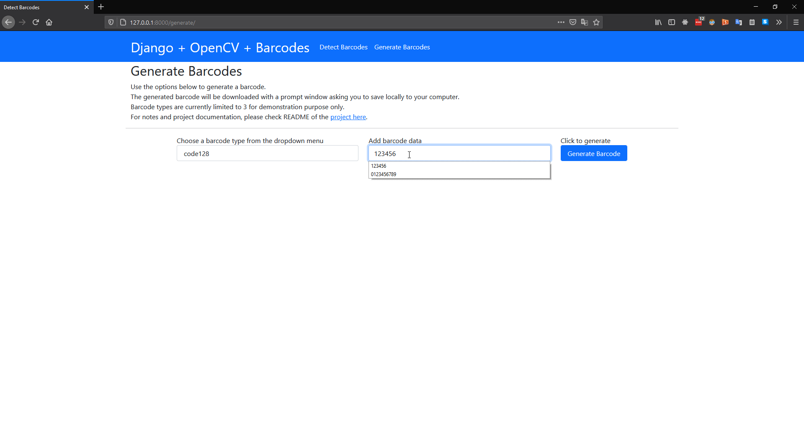

# Django web application to detect and generate barcodes

## Introduction

A simple django web application to detect and generate both 1D and QR codes on the fly.

I noticed that there are not that many articles or blog posts about a web app consuming camera feed into the OpenCV's API. Although there are many helpful articles with examples like taking a picture, pre-process it in the backend and create an image file, identifying faces in an image or identifying an object in an image etc.

The goal is to integrate OpenCV and Django as a complete web application, draw polylines on the identified barcode, and render the real-time stream from your webcam or any camera source. You will notice after that project setup that the video stream is continuously rendered to the frontend from the backend in almost real-time without any lag.

**Note: In this project I have used a USB connected camera to demonstrate the examples. Please feel free to fiddle around your own hardware resources or even go few steps further to feed an IP camera feed to the backend.**

## Examples

### *Detect barcodes example*


### *Generate barcodes example*



## Project setup

### *Software requirements*

Please make sure that you have python along with pip (or pipenv) setup on your computer.

- Python 3.7 (tested), will work for python > 3.7 I believe
- pipenv or pip

### *Hardware requirements*

- an in-built web camera (if you have a laptop) or a USB powered camera plugged into your computer

### *Installation and setup*

Open windows command line or bash shell and run:

```shell
- pipenv sync (if using pipenv) or pip install -r requirements.txt
```

If you prefer virtual environment for your project, use pipenv. If not use plain pip to setup.

Or download or clone this git repo and run pip or pipenv commands to setup the project locally.

After the dependencies are installed, create a ".env" file in the project root and add the following key-value pairs.

```dotenv
TARGET_ENV= # 'dev' or 'prod' => dev displays debug info, prod doesn't
SECRET_KEY= # a secret key for django application
CAMERA=     # an integer value; for example 1 for camera 1, 2 for second camera
```

To generate a secret key for your django application, I recommend a secret key generator tools like [https://djecrety.ir/](https://djecrety.ir/)

Generate your secret key and add this to your .env file.

And after that run the command:

```shell
python manage.py runserver (or) pipenv run python manage.py runserver
```

Open your web browser and go to project URL at: [http://127.0.0.1:8000/](http://127.0.0.1:8000/)

### *Trying out the web application*

I have added a sample PDF document with some barcodes in it. Download the file and see the web app in action.

### *Project dependencies*

Thanks to these amazing and great libraries!

- django [https://www.djangoproject.com/](https://www.djangoproject.com/)
- opencv-python [https://github.com/skvark/opencv-python](https://github.com/skvark/opencv-python)
- pyzbar [https://github.com/NaturalHistoryMuseum/pyzbar](https://github.com/NaturalHistoryMuseum/pyzbar)
- numpy [https://numpy.org/](https://numpy.org/)
- python-dotenv [https://github.com/theskumar/python-dotenv](https://github.com/theskumar/python-dotenv)
- python-barcode [https://github.com/WhyNotHugo/python-barcode](https://github.com/WhyNotHugo/python-barcode)
- pillow [https://github.com/python-pillow/Pillow](https://github.com/python-pillow/Pillow)
- qrcode [https://github.com/lincolnloop/python-qrcode](https://github.com/lincolnloop/python-qrcode)

## Intentional limitation of the proejct

I have intentionally limited the number of types of barcodes in the dropdown with a list comprehension.

Check out views.py, line 21

```python
generate_barcodes/views.py
```

"python-barcode" library has only 1D barcode types, which is why I have used LincolnLoop's qrcode library to generate the QR codes.

In the list comprehension I have only considered using code128 and code39 as they are easy and doesn't require string length checks or extra validation checks. For this I have appended ['qrcode'] for generating QR codes.

Please feel free to tweak the code as you wish and play around with all the kinds of barcode types in the python-barcode library.

You might want to checkout another barcode library that I found recently, "treepoem" - [https://github.com/adamchainz/treepoem](https://github.com/adamchainz/treepoem)

## What next?

There is a lot of room to develop this sample project into your own ideas.

For example, in the backend when a barcode is detected you could do something like:

- do a lookup matching the barcode in a database
- send the barcode data to an API to verify user authentication
- authorize or don't authorize the user based on the barcode data etc. and many more
